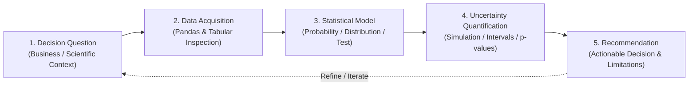

# Repository Analysis Findings: MA1001B Statistical Modeling for Decision Making

This document synthesizes the structural, pedagogical, and technical findings from an analysis of the `tec-mty-ma1001b` repository (specifically within the `draft-lecture-notes` branch/worktree). It serves as an architectural overview and developer guide for instructors, curriculum designers, and maintainers.

---

## 1. Executive Summary & Course Identity

* **Course Code:** MA1001B
* **Course Title:** Statistical Modeling for Decision Making (*Modelación estadística para la toma de decisiones*)
* **Institution:** Tecnológico de Monterrey (School of Engineering and Sciences)
* **Primary Objective:** Transform traditional undergraduate statistics and probability into an applied, data-science-oriented decision-making curriculum.

While preserving the institutional spine mandated by the official course plan (`docs/MA1001B - Analítico.pdf`), this repository operationalizes the curriculum through **Python**, **Jupyter notebooks**, **structured real-world datasets** (e.g., from Kaggle), **reproducible workflows**, and **decision-oriented communication**.

---

## 2. Core Pedagogical Framework & Reasoning Cycle

The guiding philosophy of the course is that *Python and statistical formulas are tools, not end goals*. The primary learning outcome is the ability to make defensible decisions under uncertainty using data, models, assumptions, and clear communication.

### The 5-Step Decision Reasoning Cycle
Every lesson notebook and assignment is built around an iterative five-step reasoning loop:



### The 4 Core Student Questions
Each instructional unit is designed to answer four foundational questions:
1. **What decision or problem motivates this topic?**
2. **What statistical idea helps with that decision?**
3. **How do we implement the idea in Python?**
4. **What can and cannot be concluded from the result?**

---

## 3. Curriculum & 15-Week Schedule Mapping

The repository organizes the semester into five chronological learning blocks across 15 weeks, supported by sequential Jupyter notebooks:

| Block | Weeks | Focus Area | Key Concepts | Primary Artifacts |
| :--- | :---: | :--- | :--- | :--- |
| **I. Foundations** | 1–3 | **Python & Probability** | Reproducible Jupyter workflows, Pandas data manipulation, empirical probability, simulation, conditional probability, Bayes' rule. | `lessons/01_python_jupyter_pandas.ipynb`<br>`lessons/02_probability_simulation.ipynb`<br>`lessons/03_conditional_probability_bayes.ipynb` |
| **II. Distributions** | 4–7 | **Random Variables** | Discrete models (Binomial, Poisson, Geometric, Hypergeometric), Continuous models (Uniform, Normal, Gamma), distribution fitting and assumption checking. | `lessons/04_discrete_random_variables.ipynb`<br>`lessons/05_count_models.ipynb`<br>`lessons/06_continuous_random_variables.ipynb`<br>`lessons/07_distribution_fitting.ipynb` |
| **III. Sampling** | 8–11 | **Sampling & Estimation** | Bootstrap resampling, sampling distributions ($\chi^2$, $t$, $F$), confidence intervals, standard error, variance estimation, sample size planning. | `lessons/08_sampling_distributions_bootstrap.ipynb`<br>`lessons/09_inferential_distributions.ipynb`<br>`lessons/10_estimation_confidence_intervals.ipynb`<br>`lessons/11_sample_size_variance.ipynb` |
| **IV. Inference** | 12–14 | **Testing & Design** | Hypothesis testing ($p$-values, 1- and 2-sample tests), categorical inference (goodness-of-fit, independence), A/B testing, ANOVA, residual analysis. | `lessons/12_hypothesis_testing.ipynb`<br>`lessons/13_categorical_inference.ipynb`<br>`lessons/14_experimental_design_anova.ipynb` |
| **V. Capstone** | 15 | **Challenge Synthesis** | End-to-end data science workflow on real structured data, technical reporting, oral presentation. | `lessons/15_capstone_workshop.ipynb` |

### Repeated Lesson Notebook Anatomy
To establish cognitive familiarity, every notebook in `lessons/` strictly adheres to a 13-part pedagogical anatomy:
1. **Official Alignment:** Mapping to the institutional syllabus.
2. **Usage Guide:** Instructions for instructors and students.
3. **Learning Goals:** Clear, actionable student outcomes.
4. **Decision Scenario:** A realistic business, scientific, or engineering problem.
5. **Conceptual Explanation:** Intuition behind the statistical theory.
6. **Mathematical Anchor:** Essential formulas and notations.
7. **Data & Workflow Notes:** Dataset structure and preprocessing requirements.
8. **Worked Python Example:** Guided step-by-step code execution.
9. **Guided Checkpoint:** Mid-lesson pauses for pair discussion and writing.
10. **Common Mistakes:** Explicit highlighting of statistical pitfalls and coding errors.
11. **Independent Practice:** Unassisted coding and analysis exercises.
12. **Interpretation Template:** Scaffolding for writing defensible conclusions.
13. **Exit Ticket:** Short conceptual reflection assessing understanding.

---

## 4. Repository Architecture & Directory Structure

```text
tec-mty-ma1001b/
├── assignments/         # 4 major applied assignment briefs and guidelines
├── capstone/            # Final challenge brief, proposal, and report templates
├── data/                # Dataset placement rules and Kaggle download instructions
├── docs/                # Institutional syllabus (PDF) and analytical findings
├── lessons/             # 15 sequential teaching notebooks (Weeks 1 to 15)
├── rubrics/             # Standardized evaluation rubrics for grading
├── scripts/             # Python automation tools for generation and validation
├── course_design.md     # Pedagogical philosophy and instructor guidelines
├── pyproject.toml       # Python package dependencies and project configuration
├── syllabus.md          # Complete course syllabus and weekly schedule
└── uv.lock              # Lockfile ensuring reproducible Python environments
```

### Detailed Directory Breakdown
* **`lessons/`**: Contains the core teaching material (`01_python_jupyter_pandas.ipynb` through `15_capstone_workshop.ipynb`). Designed as interactive class scripts rather than passive code demos.
* **`assignments/`**: Outlines the four applied notebook assignments:
  1. *Probability From Data* (Titanic dataset)
  2. *Distribution Modeling* (Bike Sharing Demand / House Prices)
  3. *Estimation And Uncertainty* (World Happiness Report / House Prices)
  4. *Tests And Experiments* (A/B Testing data)
* **`capstone/`**: Contains the full specification for the end-of-semester challenge project (`capstone_brief.md`), along with student templates for project proposals (`proposal_template.md`) and final technical reports (`report_template.md`).
* **`rubrics/`**: Houses reusable markdown grading criteria (`notebook_rubric.md`, `assignment_rubric.md`, `capstone_rubric.md`). These rubrics explicitly prioritize statistical reasoning, assumption checking, and decision interpretation over decorative visualizations.
* **`data/`**: Explains how to acquire external datasets. To keep the repository lightweight and comply with licensing, raw data files are ignored via `.gitignore` and must be downloaded into `data/raw/` following `data/README.md`.
* **`docs/`**: Stores institutional reference materials, including the official course syllabus (`MA1001B - Analítico.pdf`) and an analysis of its requirements, errata, and bibliographic anchors (`ma1001b-analitico-findings.md`).
* **`scripts/`**: Tooling for repository maintainers:
  * `generate_lesson_notebooks.py`: Automated builder that generates or updates the lesson notebooks from source definitions.
  * `validate_notebooks.py`: Linter and syntax checker that verifies notebook JSON validity and Python code execution.

---

## 5. Assessment & Grading Model

The course assessment aligns with the institutional 75% / 25% distribution:

| Component | Weight | Evidence & Deliverables |
| :--- | :---: | :--- |
| **Weekly Notebook Practice** | 25% | Completed lesson notebooks, guided checkpoints, and exit tickets. |
| **Applied Assignments** | 20% | Four applied data science notebooks with written interpretations. |
| **Concept Checks & Quizzes** | 15% | Short assessments covering probability, distributions, inference, and design. |
| **Practical Module Checks** | 15% | Timed, practical notebook tasks or mini-cases under examination conditions. |
| **Capstone Challenge Project** | 25% | Proposal, milestone notebooks, final technical report, and oral presentation. |

### Grading Philosophy
As emphasized in `course_design.md` and the assessment rubrics, evaluation prioritizes **reasoning quality over decorative output**. Strong submissions must:
1. Define the decision question *before* initiating data analysis.
2. Explicitly state and check statistical assumptions in context.
3. Write clean, readable, and reproducible Python code.
4. Interpret uncertainty (e.g., confidence intervals, $p$-values, standard errors) rather than merely reporting raw numbers.
5. Articulate practical limitations without weakening every conclusion into vagueness.

---

## 6. Technical Stack & Maintenance Tooling

The project relies on a modern Python data science stack managed by `uv` for ultra-fast dependency resolution and environment isolation.

### Required Python Environment (`pyproject.toml`)
* **Python Version:** $\ge 3.11$
* **Core Data Science:** `numpy`, `pandas`, `scipy`, `statsmodels`, `scikit-learn`, `pyarrow`
* **Visualization:** `matplotlib`, `seaborn`, `plotly`
* **Notebooks & Data Access:** `jupyterlab`, `notebook`, `kaggle`, `nbformat`, `nbconvert`

### Common Developer Commands

```powershell
# 1. Synchronize environment and install dependencies
uv sync

# 2. Launch interactive JupyterLab environment
uv run jupyter lab

# 3. Regenerate all 15 lesson notebooks after modifying lesson source definitions
uv run python scripts\generate_lesson_notebooks.py

# 4. Validate notebook structure, JSON integrity, and Python syntax across the repository
uv run python scripts\validate_notebooks.py
```

---

## 7. Summary for Instructors and Maintainers

When extending or teaching from this repository, maintainers should adhere to three core principles:
1. **Preserve the Reasoning Loop:** Never add a code demonstration without linking it to a decision scenario and an uncertainty interpretation.
2. **Maintain Standalone Runnable Lessons:** Lessons should use simulated or fallback data where necessary so that notebooks can execute cleanly even before students download external Kaggle datasets.
3. **Enforce Written Interpretation:** Keep the markdown reflection prompts and exit tickets intact; written justification is the primary evidence of statistical competence in this course.
